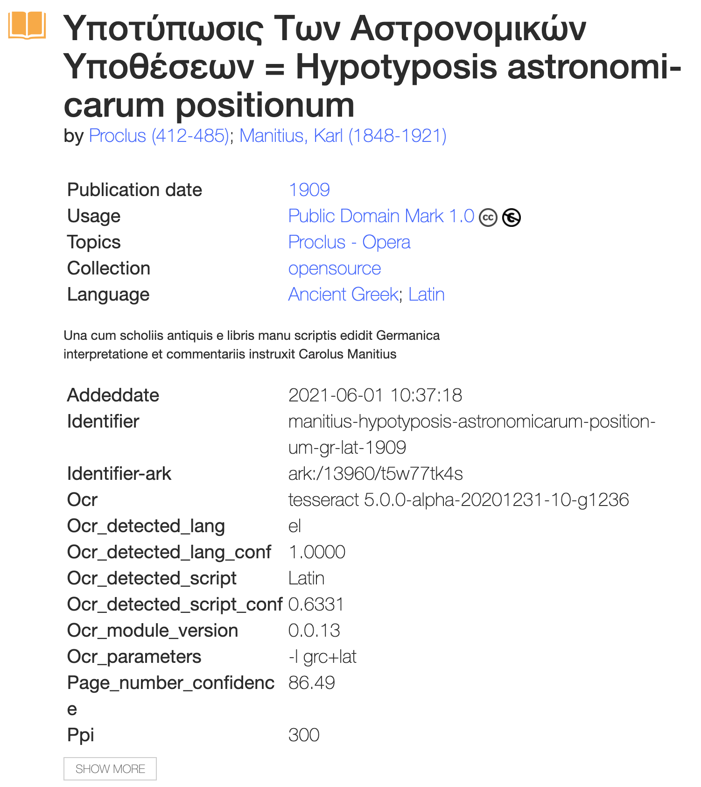

# Internet archive

- archive.org: https://archive.org

## API

- Python library
  - https://archive.org/services/docs/api/internetarchive/index.html

- ORC: https://archive.org/services/docs/api/ocr.html
  - hOCR Workflow: http://kba.cloud/hocr-spec/1.2/
  - Page: https://github.com/PRImA-Research-Lab/PAGE-XML

## Beispiel Proclus, Corulus Manitius

- https://archive.org/details/manitius-hypotyposis-astronomicarum-positionum-gr-lat-1909



- HOCR Format


### share link page

```
<iframe src="https://archive.org/embed/manitius-hypotyposis-astronomicarum-positionum-gr-lat-1909/Manitius%20-%20Hypotyposis%20astronomicarum%20positionum%2C%20gr-lat%5D%2C%201909" width="560" height="384" frameborder="0" webkitallowfullscreen="true" mozallowfullscreen="true" allowfullscreen></iframe>
```

<iframe src="https://archive.org/embed/manitius-hypotyposis-astronomicarum-positionum-gr-lat-1909/Manitius%20-%20Hypotyposis%20astronomicarum%20positionum%2C%20gr-lat%5D%2C%201909" width="560" height="384" frameborder="0" webkitallowfullscreen="true" mozallowfullscreen="true" allowfullscreen></iframe>


